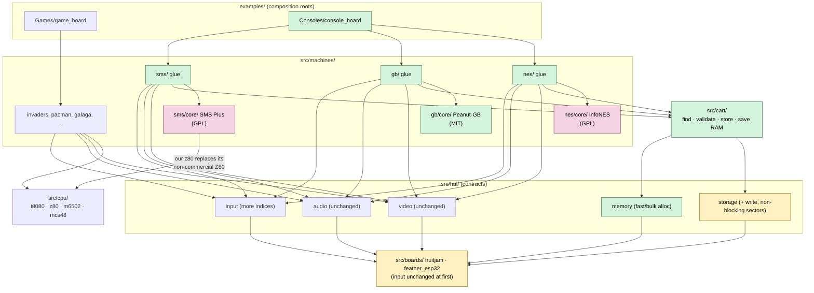

<!--
SPDX-FileCopyrightText: 2026 John Park for Adafruit Industries
SPDX-License-Identifier: MIT
-->

# Consoles: SD cards as cartridges

**STATUS: GAME BOY FIRST, STARTED 2026-09-24** on branch `gameboy-port`,
beginning with the host harness (Phase 1a). Decided that day: the **Game
Boy comes first**, ahead of the NES, because its whole port can be MIT;
consoles **boot in landscape, rotation 0**; and the Game Boy picture starts
at **1× centered**. Decided on 2026-09-23: GPL cores are acceptable
(decision 1), they live in this library, in one repo (decision 2),
consoles start on the existing GPIO arcade panel (decision 3), and saving
is limited to the cartridge's own battery-backed RAM, with no save states
and no save button. This document is not a spec: API signatures and
per-mapper detail belong in a PORTING.md addendum.

## The idea

Flash one console emulator (a NES, say) to a Fruit Jam or Feather ESP32.
Then treat SD cards like cartridges: whichever card is inserted at power-up
is the game that plays. Loading works the same way the arcade ports load
their ROMs and samples today.

The reframe that makes this fit the existing library:

> **An arcade machine is fixed hardware running one fixed program. A console
> is fixed hardware running whatever program is on the cartridge.**

In SAMP terms, a console is still a machine: memory map, video, audio,
input, assets. The only new part is that the ROM varies from card to card,
and the machine must find it and validate it. One console per firmware is
just SAMP (one machine, one board, one composition root, no runtime
selection).

## Decisions needed before any code

| # | Decision | Recommendation | Why it blocks |
|---|----------|----------------|---------------|
| 1 | **Core licensing** | **DECIDED 2026-09-23: GPL cores are acceptable.** | This lets us adopt existing, proven emulator cores instead of writing our own. But "GPL" on a repository does not mean every file in it is GPL: several bundled components carry **non-commercial** licenses, which GPL acceptance does not cover. See [Core licensing](#core-licensing-what-gpl-acceptance-does-and-doesnt-cover). |
| 2 | **Where the GPL code lives** | **DECIDED 2026-09-23: in this library, one repo, mixed licenses.** | Chosen over a separate GPL library for one repo, one install and atomic HAL changes. It makes archive linkage a Phase 0 requirement: see [One library, mixed licenses](#one-library-mixed-licenses). |
| 3 | **Console controls** | **DECIDED 2026-09-23: start with the existing GPIO arcade panel on both boards.** USB gamepads come later; a Wii Classic controller over I2C and other sources are future options. | On the Fruit Jam: D10 = A, A2 = B, A1 = C, D6 = Start, A5 = Select, D7 unused; on-board STRETCH and ROTATE kept. That's two new button indices and no contract change. The Feather layout is still open. See [Controls](#controls). |

## One library, mixed licenses

Consoles live in this library and this repo. We chose that for one repo, one
Library Manager listing, one install, one DEVNOTES, and HAL changes that
land in a single PR together with every machine they affect. The
alternatives considered were a separate GPL library that depends on this
one, a three-way split with the HAL in its own library, and relicensing
everything to GPL-3.0.

### Layout: the license boundary is a directory

```
src/machines/nes/          our glue: cartridge hookup, video, audio, input (MIT)
src/machines/nes/core/     vendored InfoNES, as adapted by pico-infonesPlus (GPL-2.0-or-later, to verify)
src/machines/gb/           our glue (MIT)
src/machines/gb/core/      vendored upstream Peanut-GB and minigb_apu (MIT)
src/machines/sms/          our glue (MIT)
src/machines/sms/core/     vendored SMS Plus, its Z80 removed (GPL)
src/cart/                  cartridge find/validate/load, save RAM (MIT)
examples/Consoles/<console>_<board>/
```

Consoles stay under `src/machines/`, because a console is a machine. Every
vendored core sits in a `core/` subdirectory, so REUSE annotations and a
reviewer's eye both find the GPL code by path. Everything we write stays
MIT, as do Peanut-GB and minigb_apu, so the Game Boy port is MIT end to
end, provided both are vendored from **upstream** (deltabeard's
repositories). PicoPlus's adapted copies sit in a GPL-3.0 repository, so
taking them from there would cloud the license for no benefit.

### The build problem, and the fix it requires

Without it, the Arduino builder compiles every `.cpp`/`.c` under `src/` and
hands **all** the object files to the linker for every sketch. With console
cores in the tree, a Space Invaders build would link InfoNES's object files.
`--gc-sections` probably drops the unreferenced code, but "probably" is not
a license boundary.

**`dot_a_linkage=true` fixes that, and it is already on `main`** (PR #22,
merged 2026-09-24; DEVNOTES #126). The builder archives the library into a
`.a` file, and the linker pulls in only the object files a sketch actually
references, so an arcade binary will contain no console code at all.
Turning it on:

- **Exposed a real file-name collision,** now fixed: the two
  `arch_audio_i2s.cpp` files replaced each other inside the archive (rule 6
  below).
- **Dropped nothing.** All 14 examples link to the same symbols, types and
  sizes as before. No board backend or arch file turned out to rely on a
  weak-symbol override or static constructor that an archive can silently
  lose.
- **Moved code around.** Identical code ran from 3% faster to 8% slower per
  frame on the Fruit Jam, depending only on where the linker placed it. No
  game came near its budget, but a console core near its budget should pin
  its hot loop in RAM rather than trust placement.
- **Leaves one cost unmeasured: build time.** Every sketch still compiles
  every console core into the archive. The arduino-cli builder is believed
  to reuse compiled library objects between builds of the same sketch, so
  this should mostly hit first builds. That needs measuring.

### Rules that keep the boundary honest

1. **`dot_a_linkage=true` stays on.** Done in PR #22; it must never be turned
   off once a GPL file lands.
2. **A release check on every arcade binary.** Run `nm` over each arcade
   ELF, using the toolchain's `nm` for RP2040 and for ESP32, and confirm it
   contains no symbols from any `core/` directory. This is mechanical, so it
   belongs in whatever builds `extras/dist/`.
3. **Console binaries in `extras/dist/` ship as GPL-3.0,** with the notice
   in the release and pointing at the public repo as the source.
4. **REUSE lint stays at 100%,** with each `core/` directory's licenses in
   `LICENSES/` and declared per file or in `REUSE.toml`.
5. **README and `library.properties` state the split plainly:** MIT, except
   `src/machines/*/core/` directories, whose licenses are listed; a sketch's
   binary carries the licenses of the cores it uses.
6. **Every source file under `src/` has a unique file name,** directory
   aside. An `.a` archive tracks members by file name only, so two files
   with the same name silently replace each other. Found for real on
   2026-09-23: turning on `dot_a_linkage` broke all seven Feather builds
   because `arch/esp32/arch_audio_i2s.cpp` and `arch/rp2040/arch_audio_i2s.cpp`
   collided. Vendored cores are full of generic names (`cpu.c`, `sound.c`,
   `z80.c`, and we already have a `z80.c`), so imports get renamed on the
   way in, and a duplicate-name check runs alongside REUSE lint.

### What stays the same

The SAMP include rules carry over unchanged. A console sketch includes
`<Adafruit_Arcade_Machines.h>` first, which keeps the `-Os` `#error` in
force, then src-root-relative headers such as
`#include <machines/nes/nes_machine.h>`.

One loose end: the library is still called "Arcade Machines" but would now
hold consoles too. Renaming again, right after September's
`arcade_arduino` → `Adafruit_Arcade_Machines` move, costs more than the
mismatch does. The plan keeps the name and mentions consoles in the
`library.properties` sentence and the README.

## What changes in the stack



Green is new, yellow is changed, pink is vendored GPL code. Everything else
is reused as-is. Nothing outside a `core/` directory is GPL, and no arcade
machine has an arrow into one, which is what the release check in rule 2
confirms on every binary.

With GPL acceptable, each console **adopts an existing core** rather than
getting a new one, and our work becomes porting it onto the HAL:
Arduino build, PicoDVI video at 252 MHz, our audio and input paths, the
cartridge loader. Our own CPU cores still matter in one place: SMS Plus
bundles a Z80 core with a non-commercial license, and our MIT `z80` is the
natural replacement.

## HAL impact

The HAL has 21 functions today; this proposal adds about 4.

| Contract | Change | Reason |
|----------|--------|--------|
| **Video** | None | The scanline-pull model suits consoles: NES and Game Boy render scanline by scanline natively, and mid-frame scroll splits (status bars) require it. NES at 256×240 fills the 320×240 canvas vertically, and Genesis at 320×224 fits almost exactly. `arcade_video_geom` needs a **console mode** for landscape-native rasters: all four rotations (ROTATE stays, for sideways-mounted cabinet monitors; see [Controls](#controls)), plus optional NES 8:7 pixel aspect. The Game Boy's 160×144 is the awkward size: 1× centered is small, and 2× doesn't fit. |
| **Audio** | None | The fill callback fits. The console's audio chip runs in the emulation loop and fills a ring buffer that the ISR only copies from (see Risks: the NES DMC channel reads cartridge ROM). |
| **Input** | **Contract unchanged; two new Fruit Jam button indices** | `HAL_BTN_ACTION2` (A2, GPIO 42) and `HAL_BTN_ACTION3` (A1, GPIO 41), with the Feather reading both as `false` for now. Mapping stays in the sketch (see [Controls](#controls)). A logical-pad layer arrives only with a second input source. |
| **Storage** | **Added create/write/remove/rename, and contiguous files rewritten sector by sector without blocking** | Battery saves. The ordinary file calls block for 6-30 ms, which is why a save uses the non-blocking `hal_storage_extent_*` calls (DEVNOTES #130). Seek was never needed. |
| **Memory** *(new)* | **A small allocation contract with a fast/bulk hint** | Cartridge ROMs outgrow SRAM (see Feasibility). Today PSRAM placement is `#ifdef`'d inside individual machines (btime, galaga, lrescue, invaders). This moves that decision into the board layer, where it belongs. |

## Controls

### Start with the arcade panel that already exists

Both boards already wire the same panel: four directions, SHOOT, COIN,
START1 and START2, each active-low to ground and debounced in the board
backend (`hal_input_fruitjam.cpp`, `hal_input_feather_esp32.cpp`). The
mapping lives in the console sketch, the composition root, the same way
`dkong_fruitjam.ino` maps HAL_BTN_SHOOT to Jump.

### Fruit Jam console layout (decided 2026-09-23)

Three action buttons in a row (A, B, C), with the arcade Start and Coin
buttons as Start and Select:

| Header pin | GPIO | Panel input | NES / Game Boy | SMS / Game Gear | Genesis (3-button) |
|------------|------|-------------|----------------|-----------------|--------------------|
| A3 / A4 / D8 / D9 | 43 / 44 / 8 / 9 | UP / DOWN / LEFT / RIGHT | D-pad | D-pad | D-pad |
| D10 | 10 | SHOOT (existing) | A | Button 1 | A |
| A2 | 42 | **ACTION2 (new)** | B | Button 2 | B |
| A1 | 41 | **ACTION3 (new)** | unused | unused | C |
| D6 | 6 | START1 (existing) | Start | Pause (SMS) / Start (GG) | Start |
| A5 | 45 | COIN (existing) | Select | unused | unused |
| D7 | 7 | START2 (existing) | unused | unused | unused |

The A1 and A2 GPIO numbers come from the arduino-pico Fruit Jam variant
(`pins_arduino.h`: A0–A5 are GPIO 40–45), and nothing in this library uses
GPIO 41 or 42 today.

**This is the one small input change consoles need:** two new button
indices on the Fruit Jam. Name them for the panel, not the console
(`HAL_BTN_ACTION2`, `HAL_BTN_ACTION3`), following the existing
`HAL_BTN_SHOOT` convention. That way a future two- or three-button arcade
game can use them too, and the console-specific meaning stays in the
sketch. They're wired like the others: internal pull-up, active-low, same
debounce. The Feather's enum gets the same two names reading `false` (pin
`-1`), exactly the pattern it already uses for MIRROR and STRETCH, so the
name set stays identical across boards.

### Feather layout (deferred; I2C controller is the preferred direction)

The Feather comes after the Fruit Jam, and its layout is deferred until
then. It has no spare GPIO outside its I2C pins (SDA 22 / SCL 20, on STEMMA
QT), and the preferred direction for its extra buttons is to use exactly
those: **an I2C controller rather than more GPIO wiring.** Candidates:

- **Wii Classic-protocol controllers through Adafruit's Wii Nunchuck
  Breakout Adapter:** the Wii Classic Controller, plus the NES Classic and
  SNES Classic controllers, which use the same connector and protocol.
  That gives a full D-pad and all buttons from one plug, on both boards.
- **Another I2C button board,** such as an Adafruit seesaw-based gamepad or
  arcade-button breakout, or a plain I2C GPIO expander so the existing
  arcade panel's extra buttons can be wired over STEMMA QT. Which ones
  exactly is still to be chosen.

Until then, a Feather console build keeps the eight-input mapping: SHOOT =
A, START2 = B, START1 = Start, COIN = Select. B on START2 is awkward for
play (Super Mario Bros. runs with B), but it's enough for bring-up. An I2C
controller also removes the pressure to give up the Feather's ROTATE line
(GPIO 37) as B. Genesis on the Feather is low-confidence anyway, so its
missing C button isn't a blocker.

### The on-board buttons: keep STRETCH and ROTATE

The Fruit Jam's three on-board buttons control the display: Button 1
STRETCH (GPIO 0), Button 2 ROTATE (GPIO 4), Button 3 MIRROR (GPIO 5).
Console games are landscape, but these buttons describe the **cabinet**,
not the game, which is why they're worth keeping:

- **STRETCH:** keep. Aspect correction matters for consoles too: the NES's
  8:7 pixels, and the choice of how big to draw the Game Boy's 160×144.
- **ROTATE:** keep. A cabinet built for Pac-Man or Galaga has its monitor
  mounted sideways (tate), and a console game on that monitor needs
  rotating to appear upright. Without ROTATE, console mode only works on
  upright monitors.
- **MIRROR:** optional. It only matters for Pepper's Ghost cabinets. The
  button costs nothing to keep, and dropping it saves nothing, so it can
  simply stay. **On the Game Boy it cycles the colour palette for now**
  (decided 2026-09-25, see "Game Boy colour palettes" below), so the Game
  Boy has no mirror toggle; the renderer still supports mirroring.

**Consoles boot in landscape: rotation 0** (decided 2026-09-24), the upright
monitor, unlike the arcade games, which each boot in their own cabinet's
orientation. ROTATE then cycles through the other three.

Careful with the names here. `arcade_video_geom` calls rotations 0 and 2
"yoko" and maps a portrait arcade raster's LONG axis onto canvas rows. A
console's raster is landscape-native, its LONG axis horizontal, so a
console in rotation 0 needs the mapping the module currently calls "tate."
The Game Boy's 1× centered start doesn't use the geometry module at all, so
this only matters once scaled modes or other rotations arrive.

Keeping ROTATE changes one earlier assumption: console mode in
`arcade_video_geom` can't be "landscape only, no rotation." It needs all
four rotations, like the arcade games have. The geometry module was built
for portrait-native arcade rasters, so whether its mapping already covers a
landscape-native source (256×240 for NES) or needs that case added is an
open question. Rotation also costs per-pixel work, as Galaga's landscape
mode showed, so each console needs its frame budget measured in every
rotation, the same way the arcade games were.

**No save button.** Saving works only the way the original cartridge
did: the game itself writes its battery-backed RAM (see the cartridge
model). There is no button combo and no save state, so every control is
the console's own.

### Later: more input sources

| Source | Boards | Notes |
|--------|--------|-------|
| **USB gamepad** | **Fruit Jam only** | The Fruit Jam has two USB host ports; PicoPlus runs two pads directly on them. The classic ESP32 has no USB host, so this can never be the cross-board answer. PIO-USB costs a PIO block and CPU time; check both against video and audio before committing. |
| **Wii Classic controller over I2C** | **Both** | The only extra input that works on both boards. It plugs into STEMMA QT through Adafruit's Wii Nunchuck Breakout Adapter. `pico-infonesPlus` already supports it on the Fruit Jam, on I2C0 (GPIO 20/21), the same bus as our TLV320 DAC (0x18). The controller sits at 0x52, so there's no address clash, and the DAC is only configured at boot. On the Feather, STEMMA QT is SDA 22 / SCL 20, both unused by this library. A Classic controller has a full D-pad, A/B/X/Y, L/R, Start and Select. A Nunchuck alone (stick plus C/Z) is not enough: it has no Start or Select. PicoPlus has a `WIIPAD_DELAYED_START` option for the Fruit Jam, so find out why before writing ours. |
| **Other I2C button boards** | Both | Seesaw-based gamepads and arcade-button breakouts, or a plain I2C GPIO expander for panel buttons. Same STEMMA QT port, but a different protocol from the Wii controllers, so each is its own small driver. |
| **Original NES/SNES controller** | Both | A shift register: latch, clock and data on three GPIOs. PicoPlus supports it on the Fruit Jam via PIO, but its default pins collide with ours (latch on GPIO 4 is our ROTATE button). On the Feather there aren't three spare GPIOs, so this is effectively Fruit Jam only. |

**I2C is the likeliest first extra source,** because it's the only one
that works on both boards and it's the preferred Feather answer. Two
things to settle before writing the driver:

- **NES Classic and SNES Classic controllers are known to differ from the
  original Wii Classic Controller in their report format,** although they
  use the same protocol and address. Read how PicoPlus handles them before
  assuming one code path covers all three.
- **Hot-plugging and absence:** STEMMA QT controllers get unplugged. The
  driver has to treat "no device at 0x52" as "no buttons pressed," never
  as a stall or a boot failure, and pick the controller back up when it's
  reconnected.

Timing matters for I2C. On the Feather, the poll belongs in the existing
1 ms FreeRTOS input task, rate-limited to once a frame, so it never touches
the render path. On the Fruit Jam, `hal_input_read()` runs inline on core
0, so an I2C read of a few bytes per frame (a fraction of a millisecond at
400 kHz, estimated) comes out of the frame budget and needs measuring like
anything else there.

### When a second source arrives: a logical pad

With only the GPIO panel, sketches read `HAL_BTN_*` directly and nothing
changes. Once a second source exists, mapping every source in every
sketch stops scaling. At that point, add one small contract: the board
backend merges every source it has (GPIO panel, Wii controller, USB pad)
into a single SNES-style bitmask (D-pad, A, B, X, Y, L, R, Start, Select).
Console sketches map that pad to their console. The arcade sketches keep
reading raw `HAL_BTN_*`, and they could adopt the pad later. Deferring
this keeps Phase 0 free of input work and designs the contract against
two real sources rather than one imagined one. In practice, the trigger
is likely the I2C controller driver, with the GPIO panel as the other
source. A Classic controller's layout (D-pad, A/B/X/Y, L/R, Start, Select)
is also the natural shape for the pad bitmask.

## The cartridge model

1. **Mount once at power-up; no hot-swap.** This matches real consoles, where
   you change carts with the power off, and keeps the existing boot-order
   rule (all SD work finishes before the video pump starts).
2. **Look in one place.** Exactly one ROM file in `/cart/`.
3. **Validate the header, the way the real hardware does:**
   - NES (iNES): bytes 0–3 are `NES\x1A`.
   - Game Boy: the Nintendo logo at 0x104 and the header checksum at 0x14D.
     The real boot ROM refuses to run a cart without them.
   - Genesis: `SEGA` at 0x100.
4. **Extend the error colors:**

   | Color | Meaning |
   |-------|---------|
   | Red | No card, or it won't mount *(existing)* |
   | Yellow | Card mounted, but no ROM in `/cart/` *(existing)* |
   | Magenta *(new)* | A ROM is present, but it's for a different console or its header is bad |

5. **Keep the save file next to the ROM:** `/cart/<name>.sav`. PicoPlus uses
   a separate `/SAVES` directory instead. Next to the ROM fits the
   one-card-per-game model better, because the save travels with its
   cartridge.
6. **Saves behave like the cartridge's battery-backed RAM, and nothing
   more.** DECIDED 2026-09-23: no save states and no save button. A game
   saves when it writes its own cart RAM (Zelda's save screen, Pokémon's
   Save menu), exactly as on the original hardware, and games without
   battery RAM can't save at all, as on the original.

   Persisting that RAM to SD without a trigger works like this:
   - **Flush when dirty and quiet.** The core marks save RAM dirty on any
     write. Once it has gone unwritten for about a second, we write it to
     `/cart/<name>.sav`. Games write save RAM in bursts, so waiting for
     quiet means one SD write per in-game save, not one per byte.
     PicoPlus's NES dirty flag (`SRAMwritten`) is the same idea, but they
     flush only on exit or menu-open; we have no menu, so quiet is the
     trigger.
   - ~~**Never leave a half-written save.** Write to a temporary file,
     then rename it over the old one.~~ **Replaced, as built (DEVNOTES
     #130).** Measured on the Fruit Jam, file operations block for 6-13 ms
     each and single 512-byte writes for up to 30 ms, against ~2.2 ms of
     queued picture, so temp-plus-rename would put red lines on screen at
     every save. Instead (decided 2026-09-25) the `.sav` is made full-size
     and contiguous at boot and **rewritten in place**, sector by sector,
     polling the card's busy state so nothing ever blocks. It stays a
     standard `.sav`, interchangeable with PC emulators.
   - **The difference from real hardware:** a battery-backed cart keeps a
     save the instant the game writes it. Here the save reaches the card
     about a second after the game's last write, and takes ~0.5 s to write,
     so pulling power in that window can lose the new save, or leave it
     half old and half new. Games guard against that themselves (Link's
     Awakening checksums each of its three files). Worth stating in the
     README.
   - **Out of scope:** real-time clocks in carts (e.g. Game Boy MBC3, used
     by Pokémon Gold/Silver). Those are a separate feature, not save RAM.
7. **The ROM goes to PSRAM at boot.** Both target boards have PSRAM, so we
   don't need PicoPlus's flash-and-reboot fallback (see Prior art).

A later, optional step: a "universal" firmware that reads the header and
dispatches to the right console. It would just be another example sketch
that includes several machines. It's not part of the initial design, and
`pico-bootLoader` already covers the multi-system case on RP2350 (see
Prior art).

## Prior art: the PicoPlus emulators

Frank Hoedemakers' [PicoPlus-devel](https://github.com/orgs/PicoPlus-devel/repositories)
organization already ships SD-card console emulators for RP2040/RP2350
boards, several of which support the Fruit Jam: NES (`pico-infonesPlus`),
Game Boy/GBC (`pico-peanutGB`), SMS/Game Gear (`pico-smsplus`), Genesis
(`pico-genesisPlus`), SNES, PC Engine and others. `retroJam` bundles six
systems for the Fruit Jam specifically, and `pico-bootLoader` puts a
menu of emulators on one RP2350 board. What follows comes from reading
shallow clones taken on 2026-09-23. The repositories are GPL-3.0, and the
emulators are ports of existing cores (InfoNES, Peanut-GB, SMS Plus,
Gwenesis, snes9x). Now that GPL is acceptable, **their adapted cores are the
natural starting point**: they already carry the RP2350 memory work
described below, and starting from upstream would mean redoing it. Their
`pico_shared` framework (menu, HSTX video, board configs) is not what we'd
take; our HAL replaces it. Credit belongs in each file and in the README,
and it would be courteous to tell Frank Hoedemakers before we publish.

### How they fit games larger than SRAM

Their shared library, `pico_shared`, picks one of two paths at boot
(`FrensHelpers.cpp`):

- **Boards with PSRAM, Fruit Jam included: copy to PSRAM.** `initPsram()`
  detects the chip at runtime. After the menu selection, `flashromtoPsram()`
  reads the whole file into a PSRAM heap and the emulator starts without a
  reboot. PSRAM is mapped at `0x11000000` through the RP2350's XIP interface
  on chip select 1, so the emulator reads it through a plain pointer. The
  Fruit Jam uses their default PSRAM chip-select pin, GPIO 47.
- **Boards without PSRAM: flash and reboot.** `flashrom()` writes the ROM
  into a reserved region of program flash in 128 KB chunks, then reboots
  and runs the ROM from XIP flash. A CRC check skips reflashing when the
  same game is already there. The "which ROM is in flash" record is erased
  before the first write, so a power cut mid-flash can't leave a record
  describing half-written content.
- **Too big for either (PC Engine CD images, hundreds of MB):** no preload.
  They CRC the first 4 KB as the save-file key and stream from SD during
  play.

### Keeping PSRAM off the hot path

The Genesis port's engineering report (`docs_v014_engineering_report.md`,
§4) states the constraint directly: *"SRAM and XIP flash bandwidth, not CPU
cycles, are the scarce resources."* Its rules, all of which we should adopt:

- **Hot data always goes in SRAM.** Allocations in PSRAM are "far slower and
  share the QMI port."
- **Lookup tables were copied into RAM to fix a real frame-rate bug.** Sound
  synthesis on core 1 was reading 47 KB of YM2612 tables from XIP flash on
  every sample. That contended with the 68000's dispatch tables and the PSRAM
  ROM, because all three share one QMI port and a 16 KB XIP cache. Sonic
  dropped to 50 fps. Copying the tables into RAM at game start restored a
  steady 60.
- **Per-game buffers are allocated at game start and freed on exit,** because
  the menu needs the same SRAM. About 10 KB of SRAM is free at game start.
- **Save RAM is allocated on first write,** with a PSRAM fallback, because
  the Genesis dev kit SGDK declares save RAM in every game it builds.

This confirms that on the RP2350, PSRAM and flash share one QMI port and XIP
cache, so DEVNOTES' XIP-stall rules apply to cartridge ROM unchanged.

### Why build ours anyway

For the Fruit Jam alone, `retroJam` already does most of what this plan
proposes, and with GPL acceptable, an MIT license is no longer part of our
case. What remains is three things none of their repos offer together:

1. **The Arduino framework:** build and flash from the Arduino IDE, like the
   rest of this library, rather than the Pico SDK and CMake.
2. **One codebase across architectures:** the same consoles on the Fruit Jam
   and the Feather ESP32 (and future boards) through the HAL. PicoPlus is
   RP2040/RP2350 only.
3. **Arcade and console machines behind one HAL,** sharing CPU cores, boards
   and documentation.

That case is narrower than before, and the plan should say so to reviewers.
If none of those three matter to Adafruit, pointing Fruit Jam users at
`retroJam` is the cheaper answer, and this plan should stop here.

## Core licensing: what GPL acceptance does and doesn't cover

A repository's top-level `LICENSE` is not the license of every file in it.
Reading the vendored cores file by file turned up components whose
original licenses are **non-commercial**. Those are not GPL, so accepting
GPL doesn't cover them. It matters because Adafruit sells the Fruit Jam and
Feather, and shipping or preloading firmware containing these components
is plausibly commercial use. **This is a finding to put in front of
Adafruit's legal review, not a legal conclusion.**

| Core | Console | License found | Status |
|------|---------|---------------|--------|
| InfoNES | NES | GPL-2 (`infones/doc/GPL2`) | **OK**, but verify it's "v2 or later": GPL-2-only can't be combined with GPL-3.0 |
| Peanut-GB | Game Boy | MIT (header of `peanut_gb.h`) | **OK**; the Game Boy port is MIT end to end |
| minigb_apu | Game Boy audio | MIT (header of upstream `minigb_apu.c`: "released under the terms of the MIT license"; README says MIT) | **OK**, from upstream. The PicoPlus copy's header only points at a LICENSE file, which in their repo is GPL-3.0 |
| SMS Plus | SMS / Game Gear | GPL (`system.c`), **but its bundled `z80.c` (Juergen Buchmueller) is "freeware for non-commercial purposes"** | **Swap the Z80** for our own MIT `src/cpu/z80/`, then OK |
| Gwenesis | Genesis | GPL (bus, VDP, I/O, `z80inst.c`), **but its bundled Musashi 68000 (`cpus/M68K/`) says "may be freely used for non-commercial purposes"** | **Swap the 68000.** Current upstream Musashi is believed to have been relicensed MIT; verify, and replace the vendored copy with it |
| snes9x | SNES | "freeware for PERSONAL USE only. Commercial users should seek permission" | **Out of scope** |

Two consequences for the plan:

- **Our own CPU cores are more valuable than before.** Our MIT `z80` makes
  the SMS core clean, and SMS moves up the roadmap as a result.
- **Every vendored core gets a file-by-file license read before it's
  imported,** not a glance at the top-level `LICENSE`. REUSE lint then
  keeps it honest, because every file in every `core/` directory must
  declare its license.

## Feasibility per console

| Console | CPU | Typical ROM size | Core to adopt | Prior art | Confidence |
|---------|-----|------------------|---------------|-----------|------------|
| **NES** | 6502 (2A03) | 40–512 KB | InfoNES, via `pico-infonesPlus` | pico-infoNES runs full-speed NES with PicoDVI on an RP2040 at 252 MHz, the same clock and video stack as ours. The I2S PIO program in `src/arch/rp2040/` came from that project. `pico-infonesPlus` supports the Fruit Jam. nofrendo runs on ESP32. | High |
| **Game Boy** | SM83 | 32 KB – 2 MB | Peanut-GB, via `pico-peanutGB` | RP2040-GB runs Peanut-GB on RP2040. `pico-peanutGB` runs GB/GBC on RP2350. retro-go runs GB/GBC on ESP32. | High |
| **SMS / Game Gear** | Z80 | 32–512 KB | SMS Plus, via `pico-smsplus`, **with our `z80`** | `pico-smsplus` (RP2040/RP2350), retro-go (ESP32) | High for the core; the Z80 swap is our work |
| **Genesis** | 68000 + Z80 | up to 4 MB | Gwenesis, via `pico-genesisPlus`, **with an MIT Musashi** | `pico-genesisPlus` holds 60 fps on the Fruit Jam with the ROM in PSRAM, **but at 378 MHz / 1.50 V with HSTX output.** Gwenesis in retro-go runs on ESP32-S3 with frame skipping. | **Medium on Fruit Jam** (clock-dependent, see below); **low on ESP32** |

Memory against those ROM sizes: the RP2350 has 520 KB of SRAM, so anything
past small NES/GB carts goes to PSRAM, with hot banks and lookup tables
kept in SRAM (see Prior art). The Feather ESP32 V2 has 2 MB of PSRAM,
which covers nearly all NES and GB carts but not Genesis.

### Why Peanut-GB, not SameBoy

SameBoy is the obvious alternative for the Game Boy: MIT, like Peanut-GB,
and one of the most accurate Game Boy emulators there is. It emulates the
display chip pixel by pixel with correct timing and passes nearly every test
ROM. That accuracy costs CPU and RAM a desktop never notices and a 252 MHz
microcontroller can't spare. We know of no microcontroller port running it
at full speed. That's an unbenchmarked judgment, not a measurement.

Peanut-GB is built for exactly our situation, and its interface lines up
with the HAL almost point for point (as vendored in `pico-peanutGB`):

- **ROM access is a callback.** `gb_init()` takes a `gb_rom_read(gb, addr)`
  function rather than a pointer to the ROM, so the cartridge loader decides
  where the ROM lives: SRAM, PSRAM, or PSRAM with hot banks cached in SRAM.
- **Cartridge save RAM is also read and written through callbacks,** so
  saves use the new storage write path without touching the core.
- **The screen is drawn one line at a time** through the draw-line callback
  set by `gb_init_lcd()`, which matches the scanline-pull video contract.
- **Header validation is built in.** `gb_init()` returns
  `GB_INIT_INVALID_CHECKSUM` or `GB_INIT_CARTRIDGE_UNSUPPORTED`, which maps
  straight onto the magenta "wrong cartridge" screen.
- **Game Boy Color support** is a compile-time switch
  (`PEANUT_FULL_GBC_SUPPORT`).
- **It already runs at full speed on RP2040 and RP2350** (RP2040-GB,
  `pico-peanutGB`).

The cost is accuracy. Because Peanut-GB renders a whole line at a time, it
will likely pass blargg's CPU instruction tests but fail many of mooneye's
timing tests. Phase 2's exit test is set accordingly.

**SameBoy still has two jobs:**

1. **Reference emulator when a game renders wrong.** Run the same ROM in
   SameBoy on the desktop and compare. It's the Game Boy equivalent of
   checking the arcade ports against MAME.
2. **Source of targeted fixes.** Peanut-GB already contains code taken from
   SameBoy, marked with comments (lines 25–28 of the header in
   `pico-peanutGB`). Borrowing a specific accuracy fix when a game needs one
   is an established practice, and both projects are MIT. Each borrowed
   piece gets the same marking.

**The Genesis clock caveat.** Our Fruit Jam backend runs at 252 MHz because
PicoDVI's 640×480 mode requires the system clock to equal the TMDS bit
clock. `pico-genesisPlus`'s 60 fps is at 378 MHz with an HSTX video path,
50% more clock. So proven feasibility on the board does not transfer to our
video stack for free. A Genesis port may need an HSTX backend for the Fruit
Jam first, which is a board-layer project in its own right.

**To verify before relying on it:**

- [x] ~~The Fruit Jam's PSRAM size.~~ **8 MB** (`psram_length=0x800000` in
      arduino-pico's boards.txt). It must be retimed after the 252 MHz clock
      change, or it returns corrupt data (DEVNOTES #129).
- [x] ~~Whether the RP2350 reaches PSRAM through the same QMI/XIP cache path
      as flash.~~ **Yes.** PicoPlus maps it at `0x11000000` on XIP chip
      select 1, and their Genesis report documents flash and PSRAM
      contending for one QMI port and a 16 KB XIP cache. DEVNOTES' XIP-stall
      rules apply to cartridge ROM directly.
- [x] ~~Peanut-GB's license.~~ **MIT**, per the header of `peanut_gb.h` as
      vendored in `pico-peanutGB`.
- [ ] InfoNES: GPL-2-only or "v2 or later"? Only the latter combines with
      GPL-3.0.
- [ ] minigb_apu's license.
- [ ] Current upstream Musashi's license (believed MIT since its
      relicensing), before swapping it into Gwenesis.
- [x] ~~That `dot_a_linkage=true` changes nothing for the existing
      games.~~ **Done and merged (PR #22, DEVNOTES #126).** It needed one
      fix (the I2S file-name collision). All 14 examples link identical
      symbols, and all seven games were run on both boards in both builds
      with no regression. Layout alone moved Fruit Jam per-frame work by
      -3% to +8%.
- [ ] How much console cores add to first-build and rebuild times, and
      whether arduino-cli actually reuses compiled library objects between
      builds (believed yes, unmeasured).
- [x] ~~Which Fruit Jam header pins are free for extra action buttons.~~
      **A1 = GPIO 41 and A2 = GPIO 42** (arduino-pico variant
      `pins_arduino.h`), unused anywhere in this library.
- [ ] Whether `arcade_video_geom`'s rotation mapping already covers a
      landscape-native console raster, or console mode must add that case.
- [ ] A Feather console layout, deferred until after the Fruit Jam. The
      preferred direction is an I2C controller on STEMMA QT, which keeps
      GPIO 37 as ROTATE. Choose which I2C boards to support.
- [ ] How NES Classic and SNES Classic controllers' reports differ from
      the Wii Classic Controller's (check PicoPlus's handling).
- [ ] Why PicoPlus needs `WIIPAD_DELAYED_START` for the Wii Classic
      controller on the Fruit Jam, before writing an I2C input backend.
- [ ] Whether a classic (non-S3) ESP32 can run Genesis at all. The
      expectation is no, but that's an educated guess, not a measurement.
- [ ] Whether Gwenesis fits a Genesis frame at 252 MHz, or whether Genesis
      requires an HSTX video backend at a higher clock.

## Roadmap

Each phase ends with a concrete, checkable exit test, in keeping with the
project's hardware-verified standard.

| Phase | Scope | Done when |
|-------|-------|-----------|
| **0. Groundwork** | ~~`dot_a_linkage=true` and the I2S file rename it requires~~ (**done**, PR #22). `HAL_BTN_ACTION2` / `HAL_BTN_ACTION3` on the Fruit Jam (GPIO 42 / 41), and as `false` on the Feather, needed before Phase 1a. Storage write/seek/rename and the memory contract, needed only from Phase 1b. The `nm` release check in the `extras/dist/` build, needed once the first GPL core lands. | The two new Fruit Jam buttons read correctly over serial, and the arcade games are unaffected. Later: SelfTest sketches for SD write/readback and PSRAM allocate/fill/verify; the `nm` check passes on every arcade binary. |
| **1a. Game Boy, Tetris** | Upstream Peanut-GB + minigb_apu (MIT). Host harness first (`extras/tools/gb_host`). `src/cart/` loader, 1× centered video, audio, input, rotation 0 default. Tetris is 32 KB with no memory-bank chip and no battery, so no PSRAM and no SD writes. | blargg's `cpu_instrs` pass on the host (`dmg-acid2` recorded). Tetris plays at 60 fps with sound on the Fruit Jam, in all four rotations, with no queue starvation. All 14 arcade builds still link identical symbols. |
| **1b. Game Boy, bank-switched carts** (**done** 2026-09-25: DEVNOTES #129, #130) | MBC1/3/5, ROMs in PSRAM, battery saves through the new storage write path. mooneye results recorded but not required (see [Why Peanut-GB, not SameBoy](#why-peanut-gb-not-sameboy)). | A save survives a power cycle on hardware. A compatibility list exists. |
| **2. NES** | Port InfoNES onto the HAL (the first GPL core): PicoDVI video at 252 MHz, our audio and input, console geometry. InfoNES brings its mappers with it, so there's no mapper-by-mapper build-up. | blargg's NES CPU tests pass on the host harness. Super Mario Bros. (NROM) and an MMC3 game run at 60 fps on the Fruit Jam with sound, **in all four rotations**. The `nm` check passes on every arcade binary. |
| **3. SMS / Game Gear** | Port SMS Plus **with its Z80 replaced by our `src/cpu/z80/`** | The license table shows no non-commercial files left. One title per system runs at 60 fps. |
| **4. Feather ESP32** | Game Boy and NES on the second board, which is the part of our case PicoPlus doesn't cover | Both run on hardware, including a save over the shared SPI bus (see Risks) |
| **5. Genesis** *(spike only)* | Swap Gwenesis's 68000 for MIT Musashi, then measure it at 252 MHz. If it doesn't fit, estimate the cost of an HSTX Fruit Jam backend at a higher clock. | A go/no-go number and a clock requirement, not a port |

## Game Boy compatibility list

Tested on the Fruit Jam, in `examples/Consoles/gameboy_fruitjam`.

| Cartridge | Type (header 0x147) | ROM | Status |
|-----------|---------------------|-----|--------|
| Tetris | 0x00, ROM only | 32 KB | Plays, with sound, in all four rotations (DEVNOTES #127) |
| Kirby's Dream Land | 0x01, MBC1 | 256 KB | Plays; its level-load screen needed the halt-yield fix (DEVNOTES #128) |
| The Legend of Zelda: Link's Awakening (DMG, v1.2) | 0x03, MBC1 + RAM + battery | 512 KB | Plays from PSRAM (DEVNOTES #129). Saves persist across a power cycle, with no effect on the picture (DEVNOTES #130) |

### Game Boy colour palettes (decided 2026-09-25)

Four palettes, cycled in this order by MIRROR (Button 3), **starting on
DMG green**:

| Palette | What it is | Source |
|---------|------------|--------|
| DMG green | The original Game Boy's screen | SameBoy `GB_PALETTE_DMG` (Core/display.c) |
| Greys | Neutral greys, 255/170/85/0: what the port showed first, and dmg-acid2's reference levels | this project |
| Pocket | The Game Boy Pocket's screen | SameBoy `GB_PALETTE_MGB` |
| Game Boy Color | The colours a Game Boy Color gives an original Game Boy game, chosen by title | SameBoy `BootROMs/cgb_boot.asm` |

**Left out, by decision:** the Super Game Boy palettes, and the Game Boy
Color's 12 palettes chosen by holding a button combination at power-on.
The choice is not remembered across power cycles (that would mean
another SD card write).

**The Game Boy Color lookup** is the boot ROM's own: only Nintendo's games
(old licensee 0x01, or 0x33 with new licensee "01") are looked up, by the
sum of the 16 title bytes, with the 4th title letter breaking ties. Any
other game gets the default combination (white, light green, dark blue
and black background; white, salmon and dark red sprites). A combination
is 12 colours: four for each sprite palette (OBJ0, OBJ1) and four for the
background, which Peanut-GB tells apart in bits 4-5 of every pixel. That is
why Link is green on a red background.

The table is **extracted, not retyped**:
`extras/tools/gb_palettes/gen_gbc_palettes.py` reads SameBoy's boot ROM
source (Expat/MIT) and writes `src/machines/gb/gameboy_palette_gbc.h`, and
records the SameBoy commit it came from. The colours are shown uncorrected
(BGR555 straight to RGB565). A Game Boy Color's own screen was dim and
washed out, so on a modern display these look more saturated than the
games did. A colour-correction curve is a possible later refinement.

## What changes in how the project works

Every arcade port is one program, confirmed on hardware title by title. A
console runs thousands of programs, each using the hardware differently, so
"confirmed on hardware" stops scaling. It gets replaced by **"this mapper or
feature passes its test ROMs," plus a compatibility list.**

This is also a real advantage over arcade work. Freely licensed test suites
(blargg's NES and GB CPU/PPU/APU tests, mooneye for GB) and open-source
homebrew games can live in the repo as test fixtures, with no ROM-legality
questions. They plug straight into the host test harness built for Galaga
and Burger Time. The Burger Time trap, an attract demo that looks like a
working game, becomes an automated pass/fail.

"Passes its test ROMs" needs care, though: a fast, scanline-based core
won't pass every timing test, and it doesn't have to. Each phase names
which suites are required and which are only recorded. For the Game Boy,
blargg's CPU tests are required and mooneye's timing tests are recorded.
For a game that looks wrong, the check is a desktop reference emulator
running the same ROM (SameBoy for Game Boy, Mesen for NES), in the same way
MAME is the reference for the arcade ports.

## Risks, predicted by DEVNOTES

- **PSRAM stalls in the audio ISR.** The NES DMC channel reads samples from
  cartridge ROM. If that ROM lives in PSRAM and the read happens inside the
  ISR, it's DEVNOTES' XIP glitch-line bug again. Mitigation: generate audio
  in the emulation loop and keep the ISR copy-only.
- **Lookup tables in flash.** PicoPlus's Genesis port lost 10 fps to sound
  synthesis reading tables from XIP flash on every sample (see Prior art).
  Any per-sample or per-pixel table a console core reads goes in SRAM,
  copied at game start if it must live in flash.
- **SD writes during video.** Saves break the "never touch SD after boot"
  rule. A blocking write stalls Core 0 and starves the scanline queue.
  With no save button, the flush happens mid-game by design (dirty, then
  about a second of quiet). So it must never block a frame: write in small
  chunks per frame while the queue stays fed, or hand the write to
  whichever core has slack. Save RAM is small (8–32 KB for most carts), but
  an SD write latency spike is still enough to starve the queue. Measure it
  with the frame-budget heartbeat, as for everything else in the frame.
- **Shared SPI bus on the ESP32 FeatherWing.** The SD slot and the TFT share
  one SPI bus, so a save write collides with the display transport rules.
  This needs design work in Phase 4, not a patch.
- **The compatibility long tail.** A NES mapper that is 95% right looks done
  until one game's status bar tears. Scope each phase by mapper and feature,
  never by "NES works." Adopting mature cores shortens this tail but doesn't
  remove it: the port onto our HAL (video timing, audio, PSRAM placement)
  can break games the core itself handles.
- **Non-commercial code slipping in.** The top-level `LICENSE` of the
  repositories we'd adopt from says GPL-3.0 while some bundled files say
  otherwise (see Core licensing). A file-by-file read before each import,
  plus REUSE lint on every `core/` directory, is the guard.
- **Archive linkage dropping an object file.** With `dot_a_linkage=true`,
  code reached only through a weak-symbol override or a static constructor
  can vanish from the link without a build error. The check before PR #22
  found no such case. From now on, any new board backend or arch file that
  depends on such code needs a direct reference, with a comment saying why.
- **A GPL symbol in an arcade binary.** The `nm` release check (rule 2 in
  [One library, mixed licenses](#one-library-mixed-licenses)) exists to
  catch this. It's only a guard if it runs on every release, so it belongs
  in the script that builds `extras/dist/`, not in a checklist.
- **`-Os`.** It already produces red screens on arcade machines, and console
  cores will be at least as sensitive. The existing `#error` in the umbrella
  header covers them automatically, as long as console sketches include
  `<Adafruit_Arcade_Machines.h>` first, like every other example.
